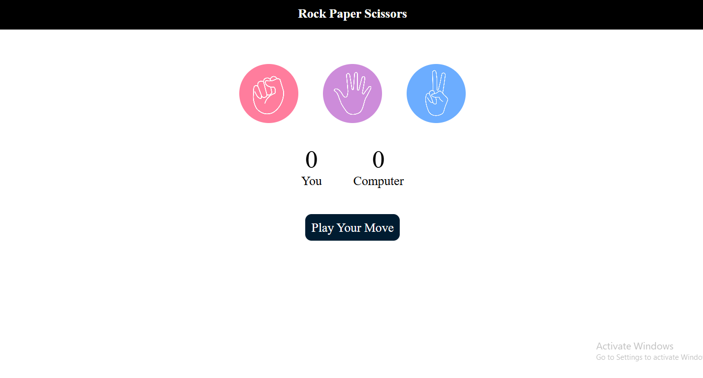
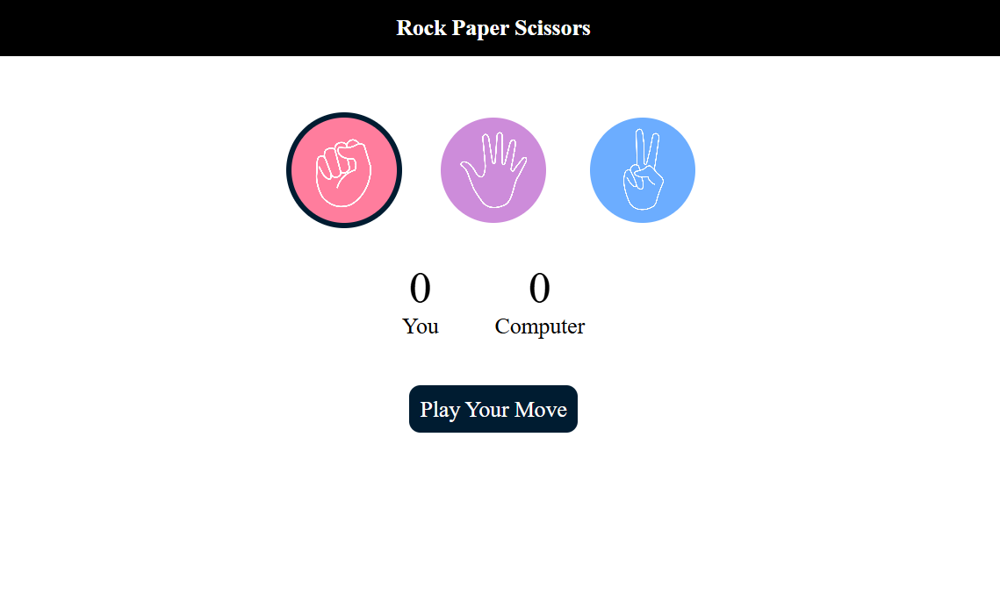
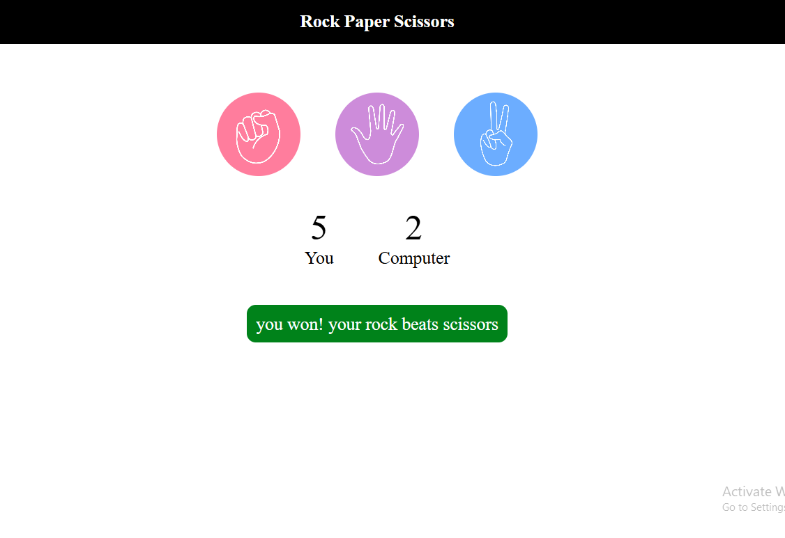

🪨📄✂️ Rock Paper Scissors Game

A simple and interactive Rock Paper Scissors browser game built using HTML, CSS, and JavaScript. The user plays against the computer, and the result is displayed instantly with score tracking.

---

🚀 Live Preview

Open index.html in your browser to play the game locally.

---

🎮 Features

User vs Computer gameplay

Random computer choice generation

Real‑time result display (Win / Lose / Draw)

Score tracking system

Clean and responsive UI

Restart / New Game option

---

🛠️ Technologies Used

HTML5

CSS3

JavaScript (DOM Manipulation & Events)

---

📂 Project Structure

Rps/
 ├── index.html
 ├── style.css
 ├── script.js
 └── pictures/

---

🧠 Game Logic

1. Player selects Rock, Paper, or Scissors

2. Computer generates a random choice

3. Rules applied:

Rock beats Scissors

Scissors beats Paper

Paper beats Rock

4. Score updates automatically

5. Result message shown on screen

---

▶️ How to Run

1. Download or clone the repository

2. Open the Rps folder

3. Double click index.html

4. Play the game in your browser 🎉

---

📸 Screenshots

###Start Game

###Game play

###Score update

---

## 🤝 Connect With Me

📧 Email: harshitakc2005@gmail.com  
💼 LinkedIn: https://www.linkedin.com/in/harshitha-kc14 
💻 GitHub: https://github.com/Harshithakc14

---

⭐ If you like this project, consider giving it a star!
